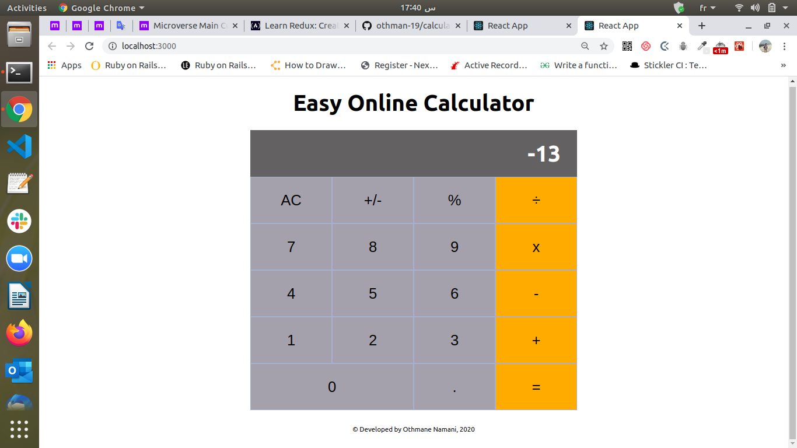

# PROJECT: Calculator_React

This application is a browser calculator built with React.js.
It is implemented with needed functional and technical requirements.

In this application the user is able to do a lot of mathematical operations with very easy, clear, and colored user interface (UI).

> This project is part of a series of projects to be completed by students of [Microverse](https://www.microverse.org/ 'The Global School for Remote Software Developers!').

## Live Demo

[Live Demo Link](https://calculator-react-othman.herokuapp.com/) .

## Built With

- React
- npm
- CSS
- ES6
- HTML5
To get a local copy up and running follow these simple example steps.

### Prerequisites

1. Git.
2. Code editor.
3. Code linter.

## How to run the program

1. Open the terminal.

2. Enter `git clone https://github.com/othman-19/calculator_react`.

3. Navigate to the cloned repository.

4. In the terminal cd into calculator_react.

5. Run `npm install` in your terminal.

6. Run `npm run start` in your termianl.

7. Open [http://localhost:3000](http://localhost:3000) to view it in the browser.

### `npm start`

Runs the app in the development mode. 
Open [http://localhost:3000](http://localhost:3000) to view it in the browser.

The page will reload if you make edits. 
You will also see any lint errors in the console.

### `npm run build`

Builds the app for production to the `build` folder. 
It correctly bundles React in production mode and optimizes the build for the best performance.

The build is minified and the filenames include the hashes. 
Your app is ready to be deployed!

See the section about [deployment](https://facebook.github.io/create-react-app/docs/deployment) for more information.

## Author(s)

[Othmane Namani](https://github.com/othman-19/).  
[Email: othmanenaamani@gmail.com](mailto:othmanenaamani@gmail.com).  
[Portfolio](https://othman-19.github.io/my_portfolio/).  
[LinkedIn](https://www.linkedin.com/in/othman-namani/).  
[twitter](https://twitter.com/ONaamani).  
[DEV Community](https://dev.to/othman).  
[Angel List](https://angel.co/othmane-namani).  

## 🤝 Contributing

Contributions, issues and feature requests are welcome!

Feel free to check the [issues page](issues/).

## Show your support

Give a ⭐️ if you like this project!
